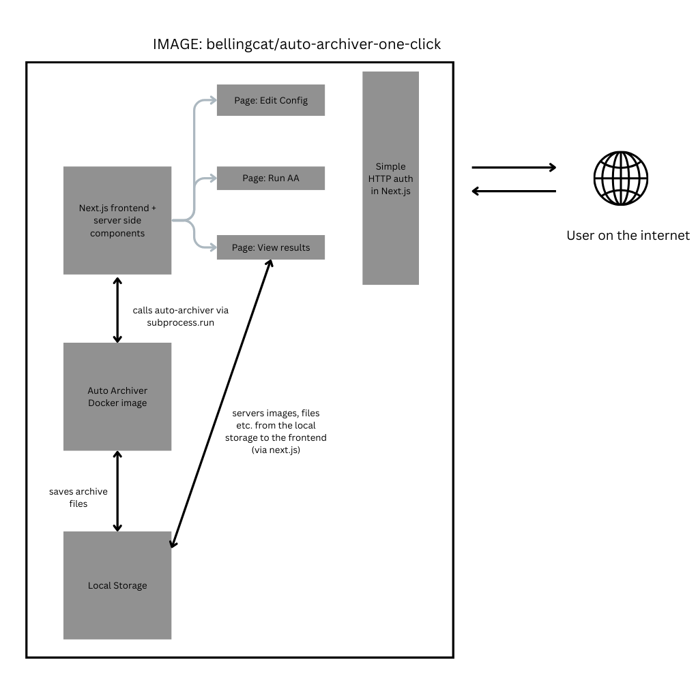

# Auto Archiver one-click

This repo lays the groundwork for a docker image that's built on top of the Auto Archiver docker image, to provide a user interface for editing config settings (using the config editor in the AA project), running the AA instance with the click of a button, and then viewing the results.

The idea is that this server can be spun up with 'one click', e.g. on a Digital Ocean server. When the user clicks to install, they'll get an IP address and randomly generated password to login to the server, then they can run AA immediately. Here's how that might look:



## Setup

To setup, run:

```bash
npm i
npm run dev
```

Note: this expects auto-archiver to be available on $PATH, so either do that or run `npm run dev` whilst in the virtualenv

### TODO:

* Fix up the docker file so that it sets up the server on first run and then servers it on port XXXX
* Add http auth to the frontend, creating a random password on first setup
* Add the config editor into this as a page (should be very easy)
* Better detection/setup of auto-archiver runtime path
* Add a page to view the results (archive html files)
* Any other improvements needed :)
